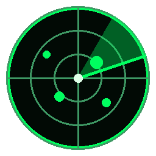

# 📡 radarWIFI PRO — NeoKali WiFi Analyzer

**Suite local de exploración de redes WiFi con estética Kali Linux.** Escanea las
redes a tu alrededor, las pinta en un radar animado, integra **nmap**, guarda
historial y exporta reportes — **todo en `127.0.0.1`, nada sale de tu equipo**.

Es una herramienta **educativa** para aprender recon WiFi y seguridad ofensiva
**ética y legal**. Inspirada en [RuView](https://github.com/ruvnet/ruview),
Sparrow-WiFi y six-eye.



## ✨ Qué trae

- **Interfaz estilo Kali**: tema oscuro verde/neón, barra lateral con categorías
  (Information Gathering, Wireless Attacks, Sensing, Herramientas), pestañas,
  scanlines CRT y terminal integrada.
- **Radar de señales** animado: cada red es un *blip*; señal fuerte = más cerca
  del centro; color por potencia (rojo=fuerte, verde=media, azul=débil); ondas
  que se expanden; etiquetas con SSID + **fabricante (OUI)**; filtros por banda,
  canal, potencia y solo-abiertas.
- **Dashboard**: conteo de redes, abiertas, 2.4/5 GHz, señal más fuerte y
  **gráfica de congestión por canal**.
- **Integración nmap** (Windows y Linux): perfiles ping / quick / full / deep
  (hosts vivos, puertos, servicios, versión y detección de SO).
- **Terminal de recon** con **lista blanca segura** (nmap, ping, arp, iw, nmcli,
  nslookup, tshark…). Historial con ↑/↓. Sin inyección de comandos.
- **Historial en SQLite** + **exportar CSV / JSON / HTML** (reporte estilo Kali).
- **WiFi Sensing (RuView)**: "ver" personas por WiFi (esqueleto 17 puntos, pulso,
  respiración, presencia, caídas). Simulado sin hardware CSI (ver abajo).
- **Módulos activos (solo Linux)**: modo monitor, **deauth ligero** (topado a 20
  paquetes, demostrativo) y captura de handshakes — con advertencias legales.

## 🧠 Núcleo cross-platform

La app es la misma; cambian las **capacidades** según el SO (se detecta solo):

| Capacidad | Windows | Linux (Kali/Parrot) |
|---|:---:|:---:|
| Escaneo WiFi (radar) | ✅ `netsh` | ✅ `nmcli`/`iwlist` |
| nmap (recon) | ✅ | ✅ |
| Terminal recon | ✅ | ✅ |
| Historial + reportes | ✅ | ✅ |
| Modo monitor | ❌ | ✅ (con adaptador compatible) |
| Deauth / handshakes | ❌ | ✅ |

> El modo monitor, deauth y captura de handshakes **no existen en Windows** —
> es una limitación del sistema, no de la app. Para eso arranca en Kali/Parrot.

## 🚀 Cómo usarlo

### Windows (tu MSI Katana)
1. Doble click en **`radarWIFI.bat`**.
2. Se abre solo en `http://127.0.0.1:8777`.
3. (Opcional) `nmap` para el módulo de escaneo: https://nmap.org/download

### Linux (Kali / Parrot) — desbloquea todo
```bash
chmod +x setup.sh && ./setup.sh      # instala nmap, aircrack-ng, iw, tshark, scapy
sudo python3 server.py               # con sudo = modo monitor / deauth / handshakes
python3 server.py                    # sin sudo = solo recon (radar + nmap)
```

## 🗂️ Estructura del proyecto

```
radarWIFI/
├── server.py               # servidor HTTP local + rutas de la API
├── index.html              # interfaz completa (Kali UI, single-file)
├── radarWIFI.bat           # launcher Windows
├── setup.sh                # instalador Linux
├── requirements.txt        # deps OPCIONALES (scapy, Pillow)
├── core/
│   ├── platform_detect.py  # SO + capacidades
│   ├── scanner.py          # escaneo WiFi (netsh / nmcli / iwlist / sim)
│   ├── nmap_integration.py # wrapper nmap (subprocess + XML, sin deps)
│   ├── oui.py              # fabricante por MAC (offline)
│   ├── database.py         # historial SQLite
│   ├── export.py           # reportes CSV / JSON / HTML
│   ├── attacks.py          # modo monitor / deauth / handshake (solo Linux)
│   ├── sensing.py          # WiFi sensing estilo RuView (mock / CSI real)
│   └── terminal.py         # ejecutor de recon con lista blanca
└── data/
    ├── oui.txt             # prefijos OUI extra (editable)
    └── radarwifi.db        # historial (se crea solo)
```

## 👁️ WiFi Sensing (ver personas por WiFi)

La vista **Sensing** recrea RuView: detectar presencia, postura (esqueleto de 17
puntos), pulso y respiración **sin cámara**, usando cómo el cuerpo perturba la
señal WiFi. Es investigación real (MIT **RF-Pose**, CMU **DensePose-from-WiFi**).

⚠️ **Va en MODO SIMULADO.** El sensing real —incluso a través de paredes—
necesita hardware que exponga el **CSI (Channel State Information)**; tu router
normal no lo da. Caminos reales, de más barato a más raro:

| Camino | Hardware | Costo aprox. |
|---|---|---|
| **ESP32-CSI** ⭐ | 2× placas ESP32 | ~$150–300 MXN |
| Nexmon CSI | Raspberry Pi 3B+/4/Zero 2 W | — |
| Intel 5300 + CSI Tool | laptop con esa NIC | usado |
| Atheros CSI Tool | tarjeta chip ath9k | variable |

El día que conectes el hardware, implementa `read_csi_frame()` en
`core/sensing.py` (mismo formato que `sensing_frame()`) y **toda la UI sigue
igual**, ahora con datos reales.

## 🖥️ Hardware recomendado (para los módulos activos en Linux)

Necesitas un adaptador WiFi con **modo monitor + inyección**:
- **Alfa AWUS036ACH / AWUS036NHA** (los favoritos de pentest)
- **TP-Link TL-WN722N v1** (chip Atheros AR9271)
- Cualquier chip **Atheros AR9271**, **Ralink RT3070/RT5370** o **MediaTek MT7612U**

## ⚖️ Uso ético y legal

Esta herramienta es para **aprender** y para auditar **tus propias redes** o
redes donde tengas **permiso explícito por escrito**. Mandar deauth, capturar
handshakes o escanear infraestructura ajena **es ilegal** en México y casi todo
el mundo. El deauth está **topado a 20 paquetes** a propósito (demostrativo, no
para hacer daño). Úsala para entender los ataques y **defenderte** de ellos.

## 🔒 Privacidad

El servidor escucha **solo en `127.0.0.1`** (no expuesto a la LAN), no hace
llamadas a internet, y el historial vive en un SQLite local en tu disco. El
código es corto y legible para que lo verifiques tú mismo.

## 📜 Licencia

MIT — haz lo que quieras con él (de forma ética y legal).
